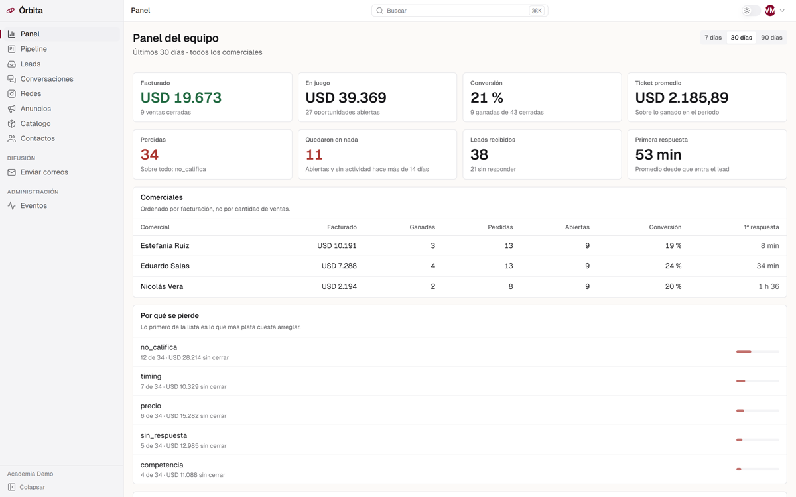
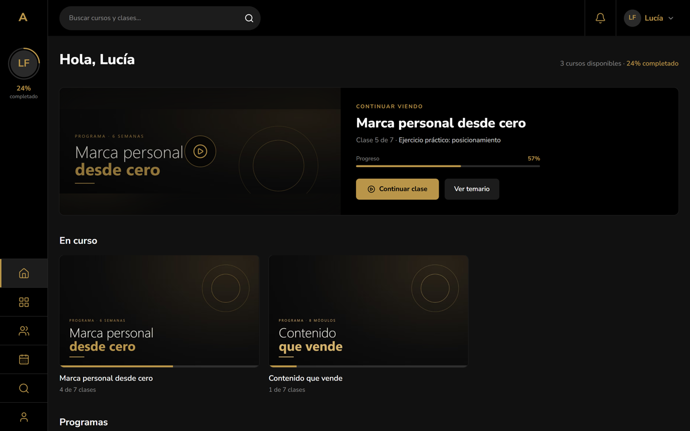
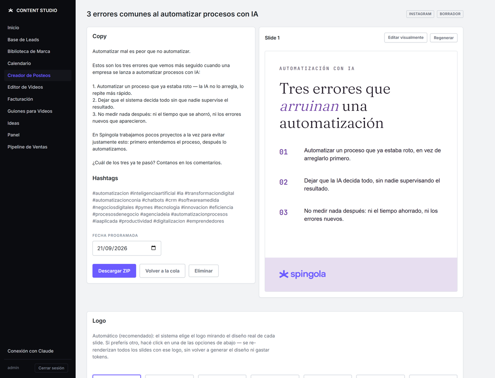
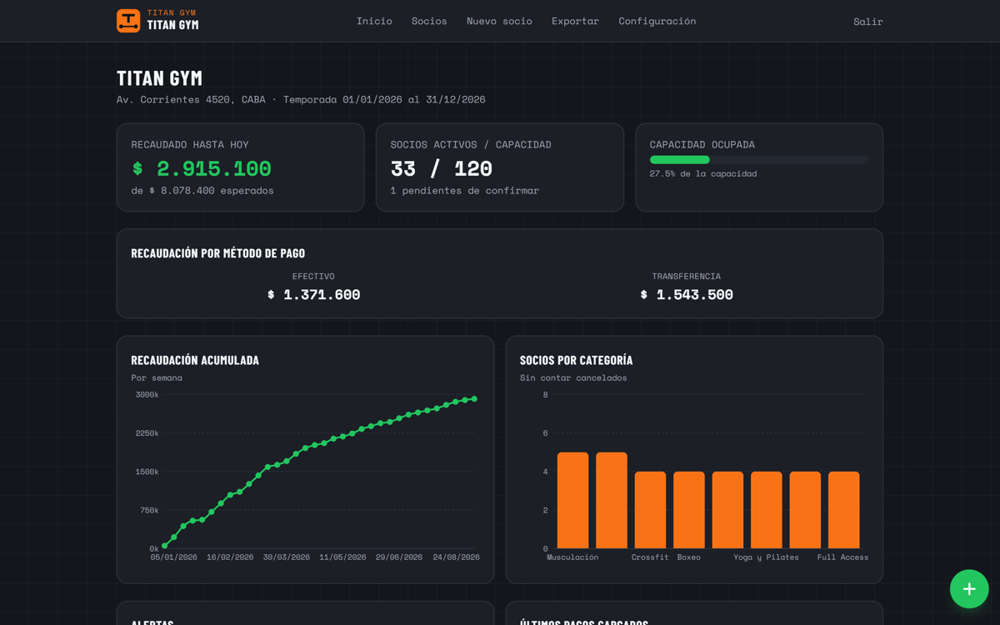
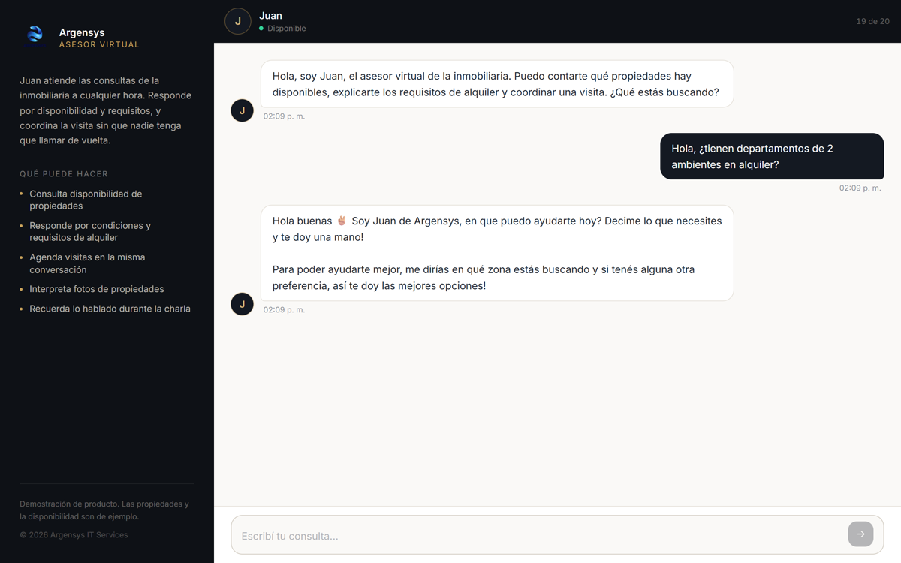

# Santino Spingola

**Desarrollo de software · Arquitectura de sistemas · Automatización e IA**

Diseño y construyo sistemas de punta a punta: entiendo el problema, defino la arquitectura, lo
desarrollo, lo despliego y lo mantengo en producción.

Trabajo en **Argensys IT Services** y desarrollo proyectos propios con **Spingola**.

📍 San Isidro, Buenos Aires · 🔗 [portfolio](https://portfolio.spingola.com.ar) ·
[CV](https://portfolio.spingola.com.ar/cv/) · ✉️ santinospingola12@gmail.com

---

## Sistemas en producción

<table>
<tr>
<td width="50%" valign="top">

<h3><a href="https://github.com/SantinoSpingola/orbita-crm">Órbita</a> · CRM comercial multi-tenant</h3>
Leads de redes y anuncios, pipeline por comercial, contact center de WhatsApp y métricas del
equipo en tiempo real. Monolito modular con fronteras verificadas por lint, RLS por tenant y
event bus con outbox.  
<code>Next.js 15</code> <code>PostgreSQL</code> <code>Drizzle</code> <code>Evolution API</code> · <b>500 tests</b>
</td>
<td width="50%" valign="top">

<h3><a href="https://github.com/SantinoSpingola/aula-plataforma-cursos">Aula</a> · plataforma de cursos autoalojada</h3>
Área de miembros estilo Hotmart Club con video propio en HLS y links firmados, accesos por
webhook de Mercado Pago, Stripe y Hotmart, mentorías y PWA con push. +40 GB de video migrados
desde Hotmart.  
<code>Next.js 16</code> <code>PostgreSQL</code> <code>ffmpeg</code> <code>Docker</code> <code>Caddy</code>
</td>
</tr>
<tr>
<td width="50%" valign="top">

<h3><a href="https://github.com/SantinoSpingola/content-studio">Content Studio</a> · panel de agencia con IA</h3>
Posteos con slides renderizadas, guiones, edición automática de video, CRM liviano y facturación
electrónica ARCA. Motor LLM: Claude Code en modo headless, sin costo por token. Operable por
WhatsApp.  
<code>FastAPI</code> <code>HTMX</code> <code>Playwright</code> <code>Remotion</code> · <b>485 tests</b>
</td>
<td width="50%" valign="top">

<h3><a href="https://github.com/SantinoSpingola/titan-gym">Titan Gym</a> · socios, cuotas y cupos</h3>
Gestión de inscripciones con plan anual en cuotas, semáforo de saldo, alertas de cupo y apto
físico y export para tesorería. Nació para un campamento y se adaptó a gimnasios sin tocar el
dominio.  
<code>Next.js 15</code> <code>Drizzle</code> <code>Supabase</code> <code>Vitest</code> · <a href="https://titan-gym.vercel.app">demo</a>
</td>
</tr>
</table>

## Automatizaciones e IA

<table>
<tr>
<td width="50%" valign="top">

<h3><a href="https://github.com/SantinoSpingola/argensys-chatbot">Asesor inmobiliario con IA</a></h3>
Agente que responde consultas de propiedades con texto, audio e imágenes y agenda visitas.
Interfaz en Next.js, lógica en n8n.
▶ <a href="https://sistema-inmobiliarias.vercel.app">Probar la demo</a>
</td>
<td width="50%" valign="top">
<h3><a href="https://github.com/SantinoSpingola/n8n-automatizaciones">n8n-automatizaciones</a></h3>
Siete flujos en producción, con diagrama y decisiones de diseño:

- Agente de operaciones por WhatsApp (61 nodos) que crea contenido y **emite facturas en ARCA**
  con validación previa
- Poller de trabajos asíncronos que entrega resultados por WhatsApp
- Facturación conversacional con **motor de cálculo determinístico**: el LLM conversa, el código
  hace las cuentas
- Asesor con buffer de mensajes en Redis, transcripción y visión
- Bienvenida a grupos con línea base y freno anti-spam

</td>
</tr>
</table>

**También:** [gestion-starter](https://github.com/SantinoSpingola/gestion-starter), el núcleo de
Órbita extraído como base reutilizable para sistemas de gestión ·
[smart-money-tracker](https://github.com/SantinoSpingola/smart-money-tracker), análisis on-chain
multicadena con detección de flotas de bots.

---

## Stack

**IA aplicada** · Claude API · Claude Code (headless) · agentes con herramientas · DeepSeek /
OpenAI · MCP

**Integraciones** · n8n · Evolution API (WhatsApp) · Bitrix24 · ERPs vía REST y SOAP/WSDL ·
ARCA · Mercado Pago · Stripe · Hotmart · Meta Graph API · OAuth2 · webhooks

**Backend** · TypeScript · Node.js · Python · Next.js · FastAPI · PostgreSQL · Drizzle ORM · Redis

**Frontend** · React · Next.js · Tailwind CSS · HTMX

**Infraestructura** · VPS Linux · Docker Compose · Caddy · Vercel · Supabase · GitHub Actions

## Cómo trabajo

- **Primero el proceso, después el código.** Relevo cómo se trabaja hoy y qué duele antes de
  decidir qué construir.
- **La IA conversa; las reglas del negocio viven en código.** Montos, permisos y emisiones fiscales
  nunca dependen de lo que conteste un modelo.
- **Calidad verificable.** Tests contra bases reales, fronteras de arquitectura que hace cumplir
  el linter y decisiones documentadas con sus alternativas descartadas.
- **Producción propia.** Despliego y opero lo que construyo: VPS, Docker, backups y monitoreo.
